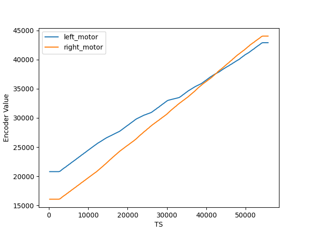
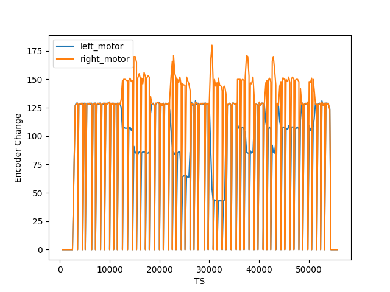

<!-- omit from toc -->
# SLAM From Scratch

<!-- omit from toc -->
# Table of Contents

- [Introduction](#introduction)
- [1. Getting Started with Robot](#1-getting-started-with-robot)
  - [Reading the Robot Motion Data](#reading-the-robot-motion-data)
- [2. Use Sensor Data to improve Robot's State](#2-use-sensor-data-to-improve-robots-state)
- [3. Filtering](#3-filtering)
- [4. Kalman Filter](#4-kalman-filter)
- [5. Particle Filter](#5-particle-filter)
- [6. Simultaneous Localization and Mapping](#6-simultaneous-localization-and-mapping)
- [Resources](#resources)

# Introduction

The aim of this project is to improve my fundamental understanding of how SLAM works under the hood including the mathematics involved which we often take for granted when we take the latest repository/research papers and try to implement them in our systems.

The project is divided into multiple units:

1. Getting Started with Robot
2. Use Sensor Data to improve Robot's State
3. Filtering
4. Kalman Filter
5. Particle Filter
6. Simultaneous Localization and Mapping

# 1. Getting Started with Robot

## Reading the Robot Motion Data

Robot Motion Data is available in the file [robot4_motors.txt](./data/robot4_motors.txt).

It holds the data as follows:

| Motor Indication | Time Stamp | Left Encoder Value | * | * | * |Right Encoder Value|* | * | * |
|---|---|---|---|---|---|---|---|---|---|

So we read the data from index 1, 2 and 6.

We initially see the encoder values as shown below which indicate the robot is stationary for a first few time instances.

We calculate per time stamp encoder change which indicates which motor was moved as shown:

# 2. Use Sensor Data to improve Robot's State

# 3. Filtering

# 4. Kalman Filter

# 5. Particle Filter

# 6. Simultaneous Localization and Mapping

# Resources

- SLAM Lectures by Claus Brenner

